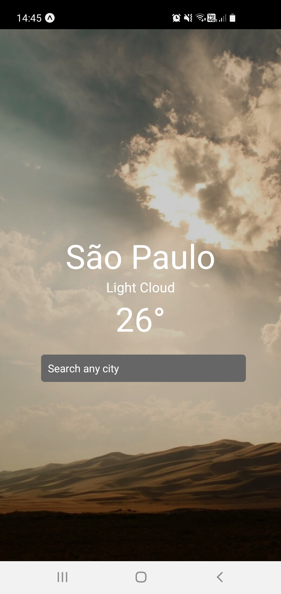

<h1 align="center">
  App Clima
</h1>

 

  

## ✨ Tecnologias

Esse projeto foi desenvolvido com as seguintes tecnologias:

- [React Native](https://reactnative.dev/)
- [Expo](https://expo.io/)

## 💻 Projeto

Aplicativo para mostrar o clima atual em determinada cidade. usado a api gratuita https://www.metaweather.com/api/.

## 🔖 Layout

Você pode visualizar o layout do projeto através [desse link](https://www.figma.com/file/IhQRtrOZdu3TrvkPYREzOy/PlantManager/duplicate). É necessário ter conta no [Figma](http://figma.com/) para acessá-lo.

## 🚀 Como executar

- Clone o repositório
- Instale as dependências com `yarn`
- Inicie seu app com `expo start`
- Você será redirecionado para o navegador, use seu celular para escanear o codigo QR e abrir o aplicativo
